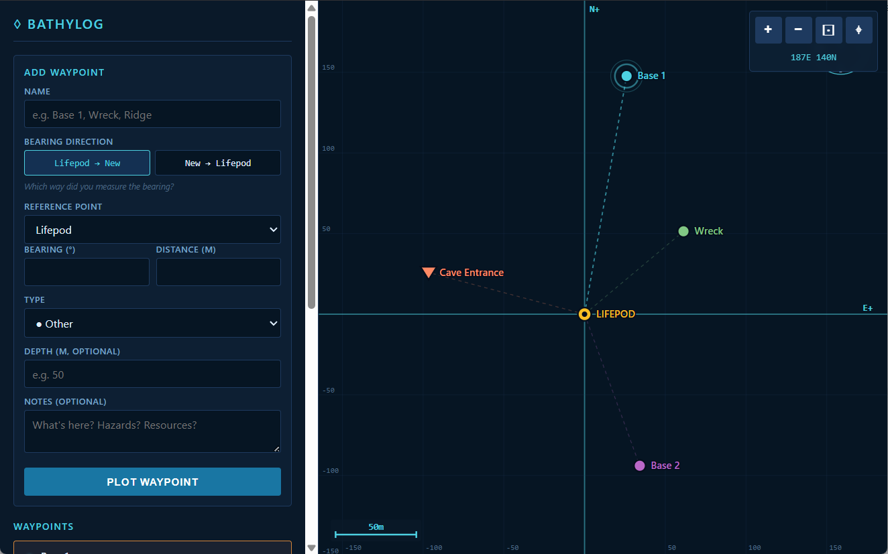

# BathyLog

A web app for charting underwater waypoints by bearing and distance. Built with Subnautica-style exploration in mind.
Plot bases, wrecks, caves, resources, and hazards relative to known points.

Live at <a href="https://odie5533.github.io/bathylog/">odie5533.github.io/bathylog</a>

## Features

- Plot waypoints by bearing (°) + distance (m) from any existing reference point
- Bearing direction works either way: *Ref → New* or *New → Ref*
- Waypoint types: base, wreck, cave, resource, landmark, hazard, other
- Optional depth and notes per waypoint
- Pan / zoom map, fit-all, recenter on Lifepod
- Edit, focus, or delete any waypoint
- Auto-saves to browser storage; export/import as JSON

## Usage

Open [index.html](index.html) in any modern browser. No build step, no dependencies.

## License

See [LICENSE](LICENSE).
